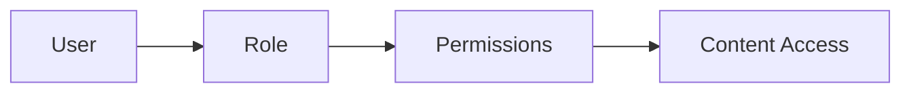

# Access Control

Knowledge access and permissions.

## Features

- Role-based access
- Document permissions
- User groups
- Inheritance rules
- Audit logging
- Anonymous access
- Guest permissions
- Delegation
