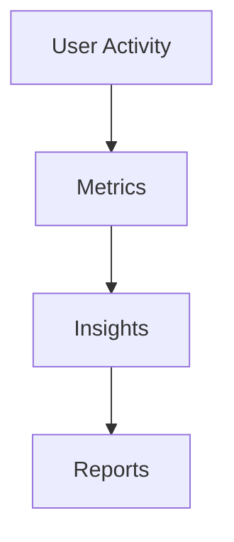

# Analytics

Knowledge usage and analytics.

```mermaid
graph TD
    A[User Activity] --> B[Metrics]
    B --> C[Insights]
    C --> D[Reports]
```

## Metrics

- Page views
- Search queries
- Top articles
- User engagement
- Content gaps
- Update frequency
- Usage trends
- Performance metrics
