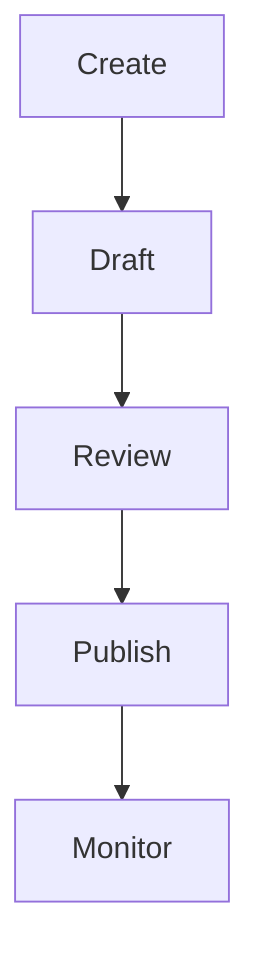

# Content Creation

Content authoring and management.

## Tools

- Rich text editor
- Markdown support
- Document templates
- Formatting options
- Media embedding
- Code snippets
- Collaborative editing
- Draft management
