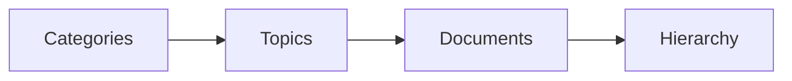

# Organization

Knowledge organization and structure.

## Features

- Category management
- Topic creation
- Hierarchical structure
- Tags and metadata
- Related items
- Breadcrumb navigation
- Taxonomy management
- Custom hierarchies
