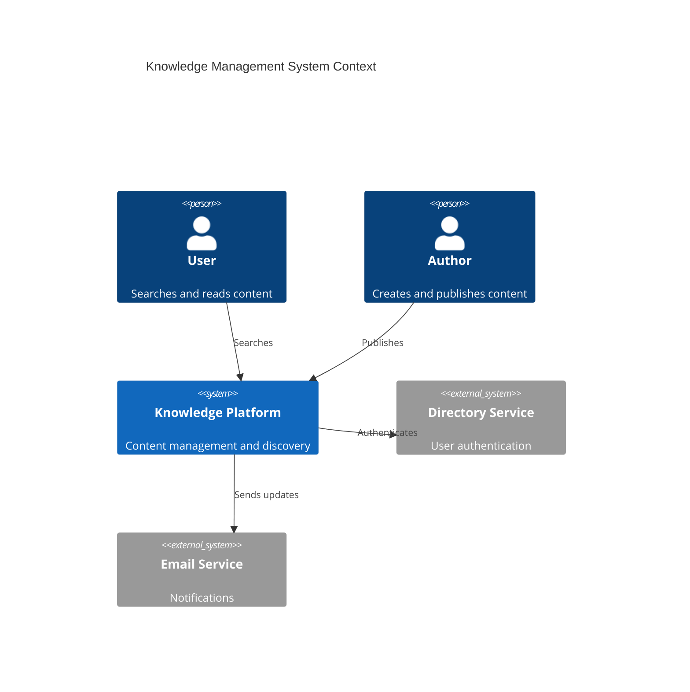
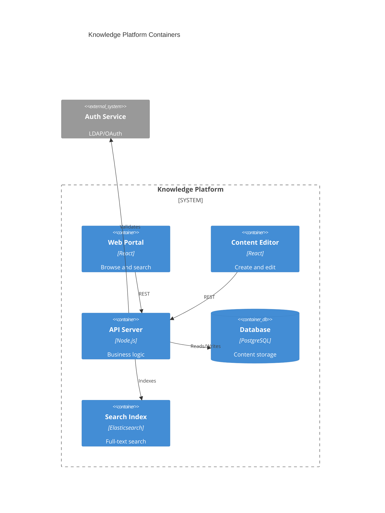
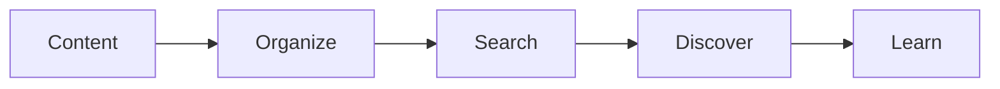

# Knowledge Management

Enterprise knowledge management system.

## System Context

## System Containers

## Overview

## Features

- Document repository
- Wiki pages
- Topic organization
- Full-text search
- Tagging system
- Version control
- Access permissions
- Collaboration tools
