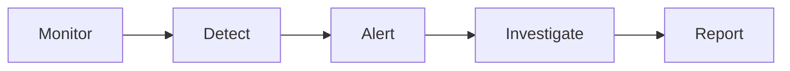

# Audit & Monitoring

Audit and continuous monitoring.

## Features

- Audit trails
- Activity logging
- Anomaly detection
- Alert system
- Evidence collection
- Audit reports
- Exception handling
- Remediation tracking
