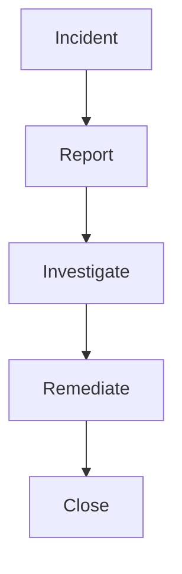

# Incident Management

Incident tracking and management.

## Features

- Incident tracking
- Root cause analysis
- Action items
- Status updates
- Notification system
- Trend analysis
- Lesson learned
- Prevention measures
