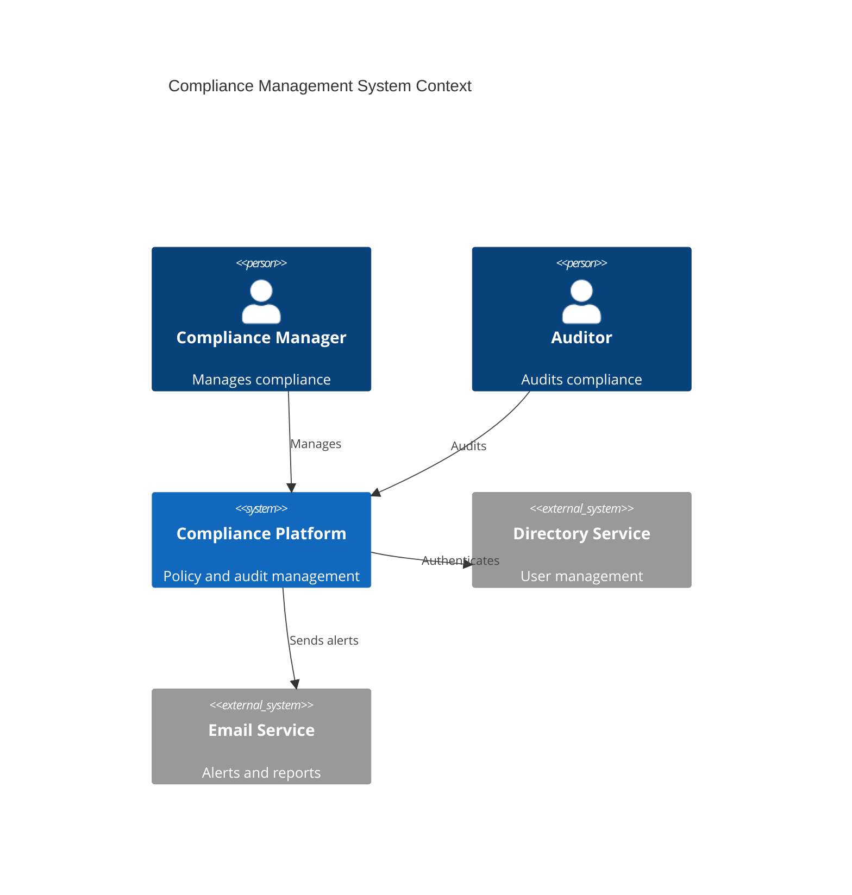
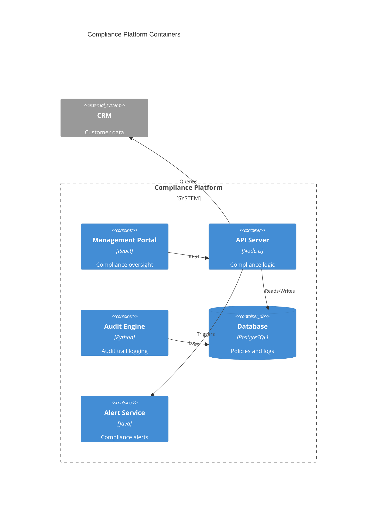
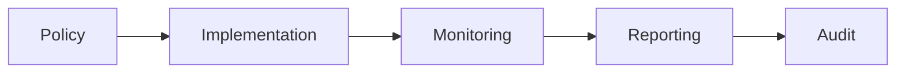

# Legal Compliance

Enterprise legal and compliance management.

## System Context

## System Containers

## Overview

## Features

- Regulatory tracking
- Policy management
- Compliance checklists
- Document management
- Audit trails
- Risk assessment
- Incident tracking
- Training management
