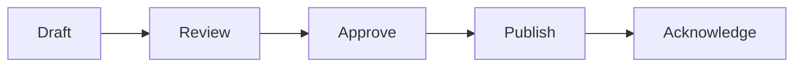

# Policy Management

Policy creation and enforcement.

## Features

- Policy templates
- Policy creation
- Version tracking
- Distribution
- Acknowledgment tracking
- Training assignments
- Exception management
- Policy renewal
