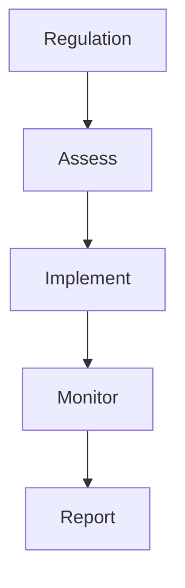

# Regulatory Management

Regulatory compliance management.

## Features

- Regulatory database
- Jurisdiction tracking
- Compliance deadlines
- Gap analysis
- Action tracking
- Evidence documentation
- Status dashboards
- Compliance reporting
