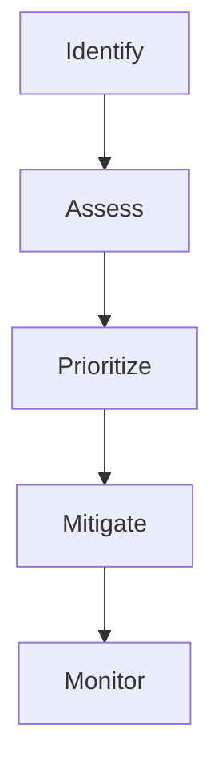

# Risk Assessment

Risk identification and assessment.

## Features

- Risk identification
- Risk scoring
- Assessment templates
- Mitigation planning
- Control mapping
- Residual risk
- Risk trending
- Risk reporting
