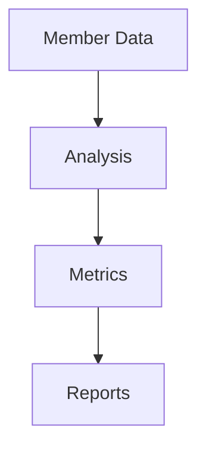

# Analytics

Program performance and member analytics.

## Metrics

- Active members
- Engagement rate
- Points redemption rate
- Member lifetime value
- Churn rate
- Tier distribution
- Revenue impact
- Program ROI
