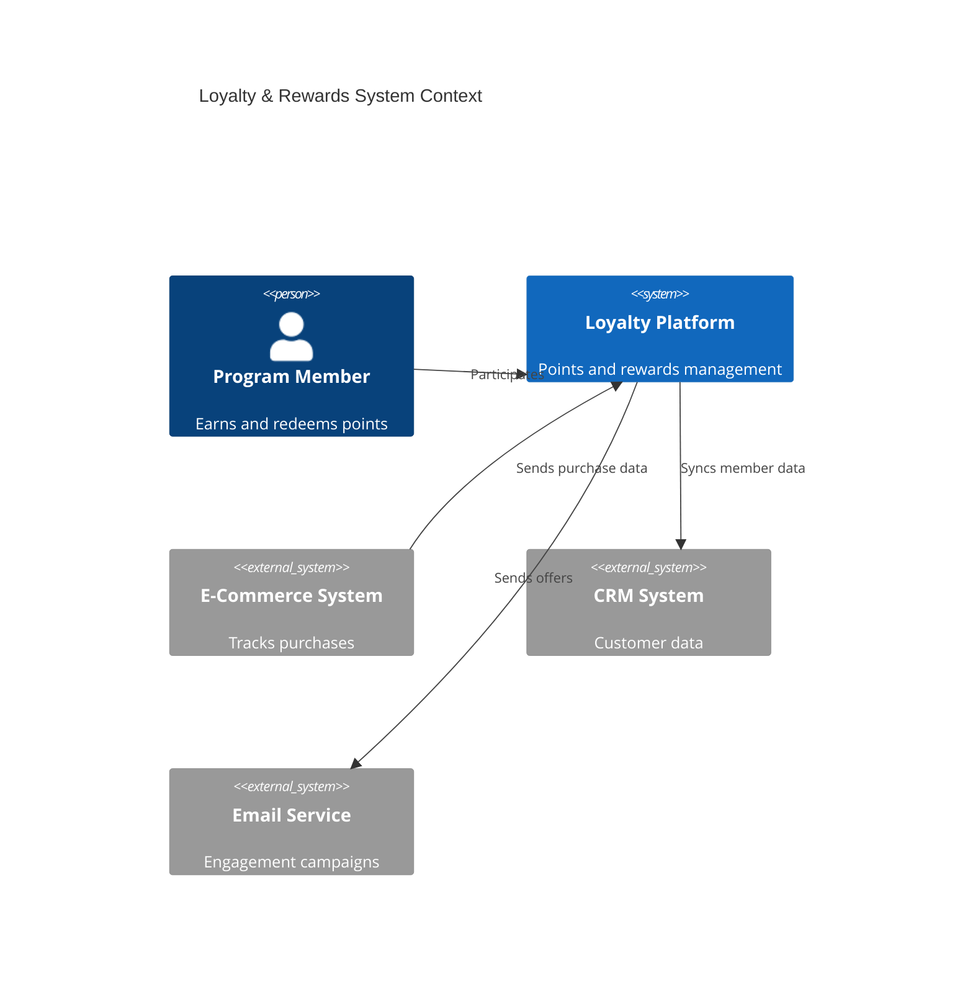
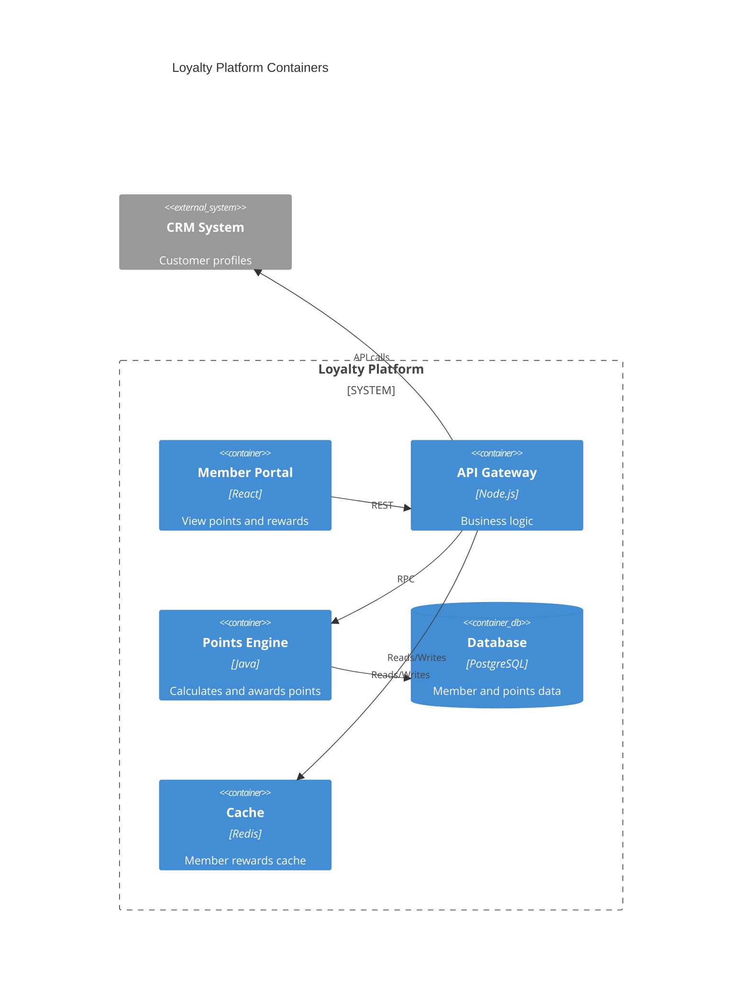
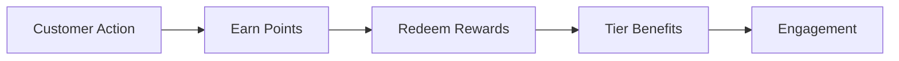

# Loyalty & Rewards

Loyalty program and customer rewards management.

## System Context

## System Containers

## Overview

## Features

- Points system
- Reward tiers
- Points redemption
- Member benefits
- Referral rewards
- Anniversary rewards
- VIP programs
- Engagement tracking
