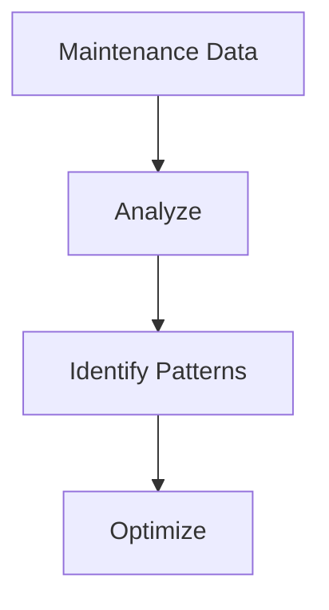

# Analytics & Optimization

Maintenance analytics and optimization.

## Features

- Performance metrics
- Equipment reliability
- MTBF/MTTR tracking
- Cost analysis
- Trend analysis
- Predictive analytics
- KPI dashboards
- Optimization recommendations
