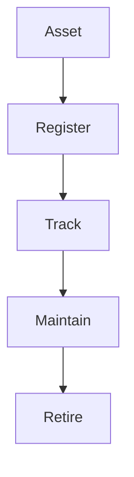

# Asset Management

Asset and equipment management.

## Features

- Equipment registry
- Maintenance history
- Failure tracking
- Spare parts
- Service records
- Documentation
- Downtime tracking
- Asset lifecycle
