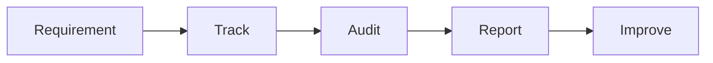

# Compliance & Safety

Maintenance compliance and safety.

## Features

- Safety protocols
- Compliance requirements
- Inspection schedules
- Hazard identification
- Risk management
- Training tracking
- Incident reporting
- Safety documentation
