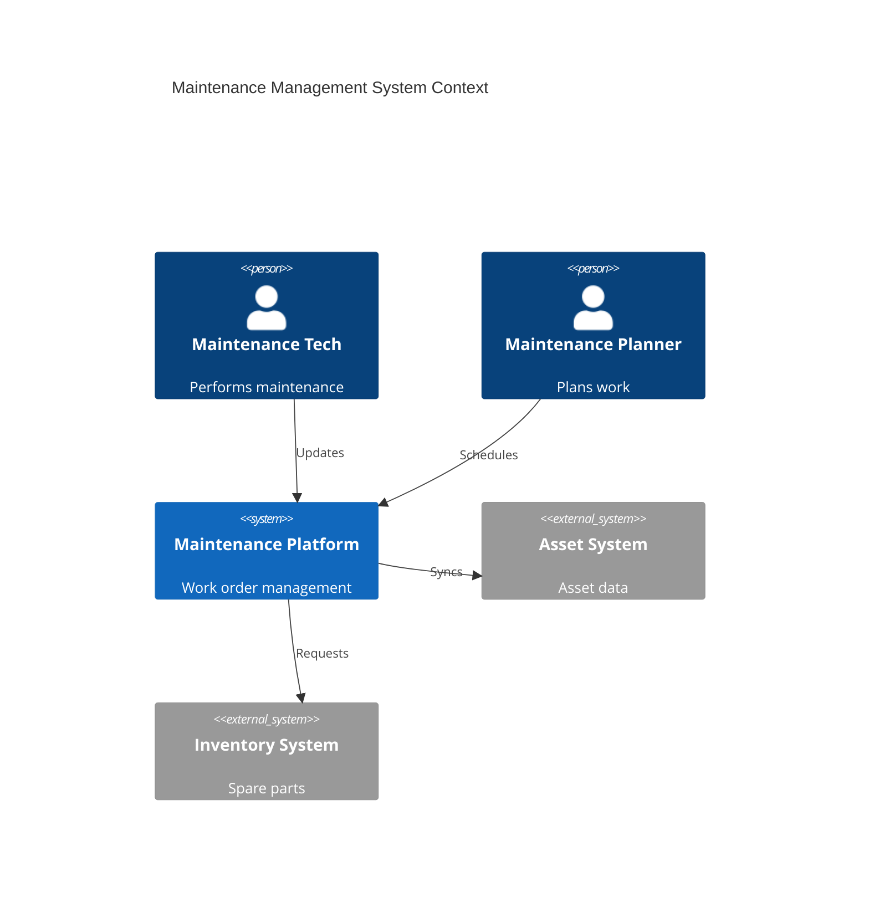
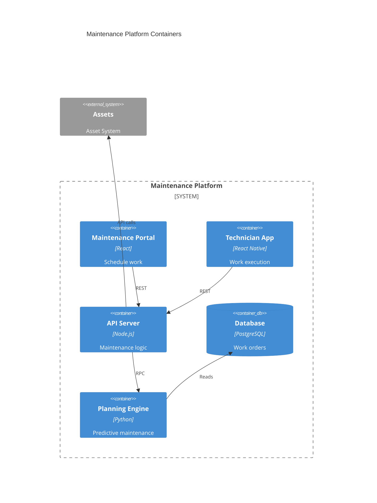
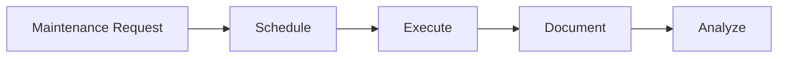

# Maintenance Management

Maintenance operations and management.

## System Context

## System Containers

## Overview

## Features

- Preventive maintenance
- Predictive maintenance
- Work order management
- Technician scheduling
- Parts management
- Equipment history
- Compliance tracking
- Maintenance analytics
