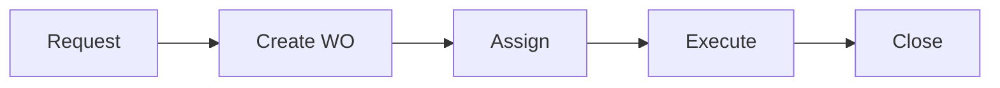

# Work Order Management

Maintenance work order management.

## Features

- Work order creation
- Priority assignment
- Technician routing
- Status tracking
- Time tracking
- Parts tracking
- Cost tracking
- Completion verification
