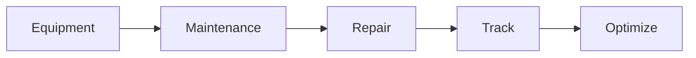

# Equipment Management

Manufacturing equipment management.

## Features

- Equipment registry
- Maintenance schedules
- Preventive maintenance
- Breakdown reporting
- Maintenance history
- Spare parts tracking
- Equipment analytics
- OEE tracking
