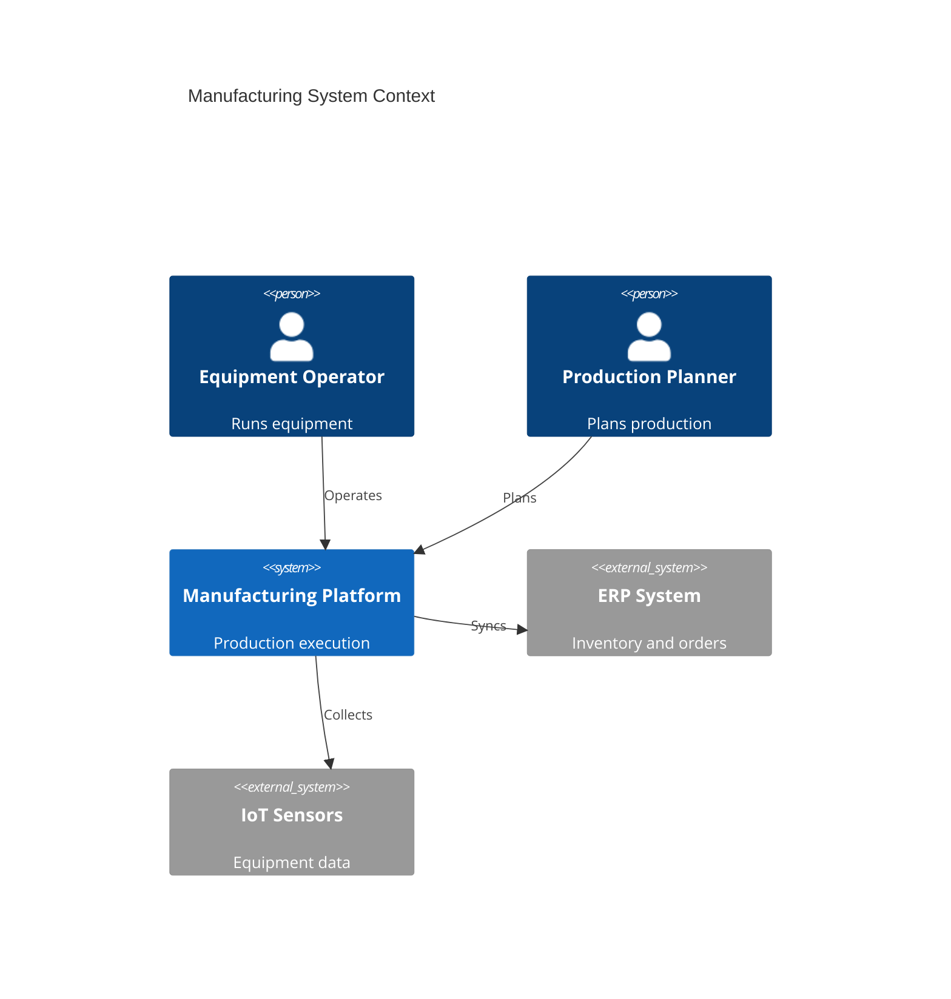
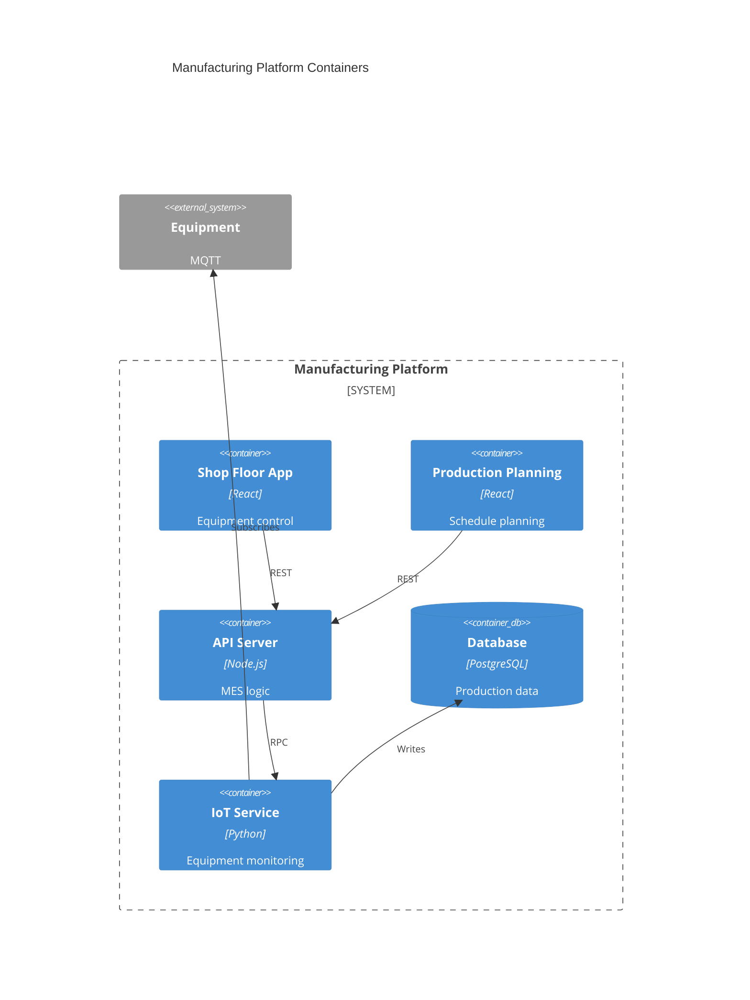
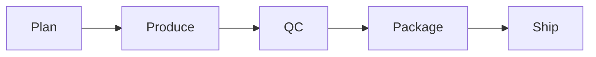

# Manufacturing

Manufacturing operations management.

## System Context

## System Containers

## Overview

## Features

- Production planning
- Work order management
- Machine scheduling
- Quality control
- Equipment tracking
- Maintenance management
- Batch tracking
- Production analytics
