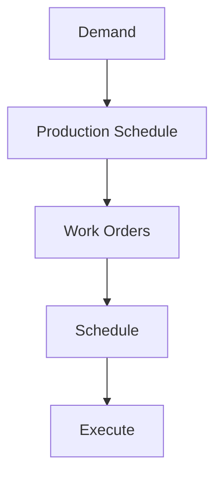

# Production Planning

Production planning and scheduling.

## Features

- Master production schedule
- Work order generation
- Resource planning
- Machine scheduling
- Line balancing
- Lot sizing
- Scheduling optimization
- Plan tracking
