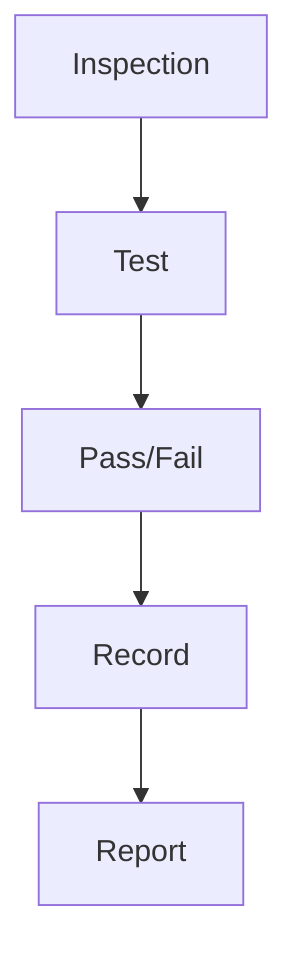

# Quality Control

Manufacturing quality control.

## Features

- Inspection planning
- Test setup
- Pass/fail recording
- Sample testing
- SPC charts
- Non-conformity tracking
- Corrective action
- Quality reports
