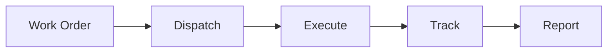

# Shop Floor Control

Shop floor execution and control.

## Features

- Work order dispatching
- Real-time tracking
- Labor tracking
- Equipment tracking
- Status updates
- Exception handling
- Progress monitoring
- Performance metrics
