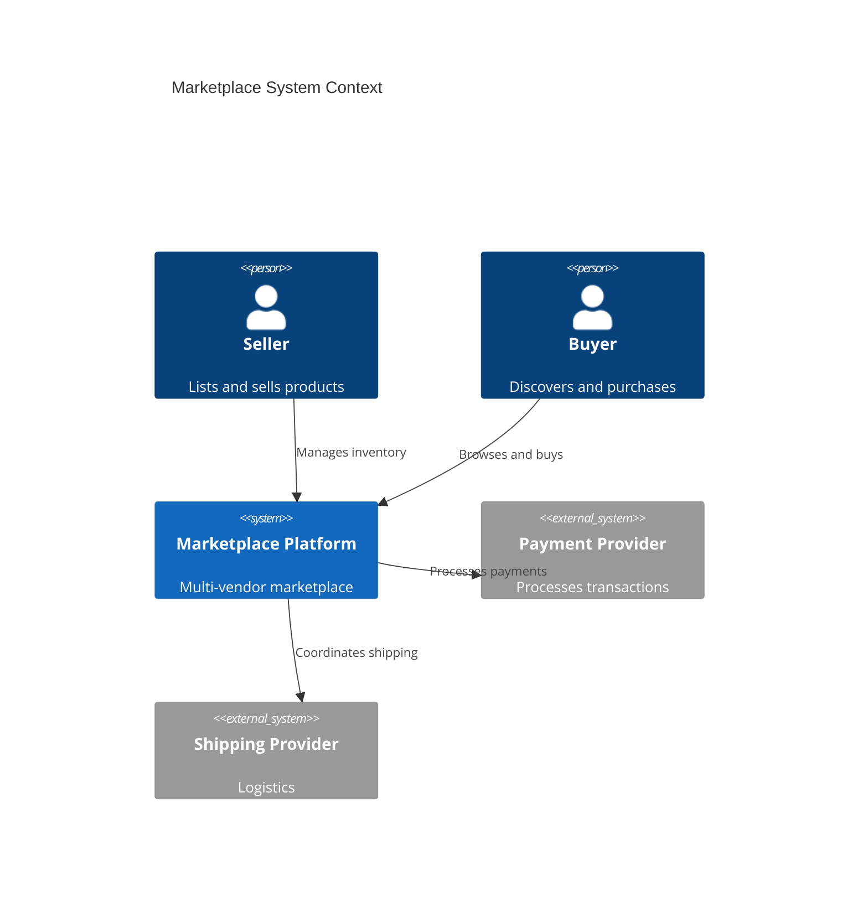
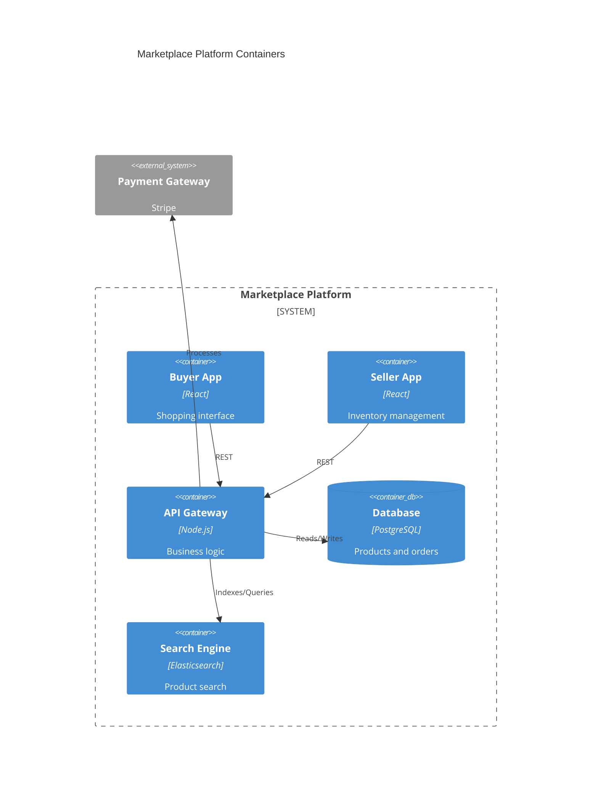
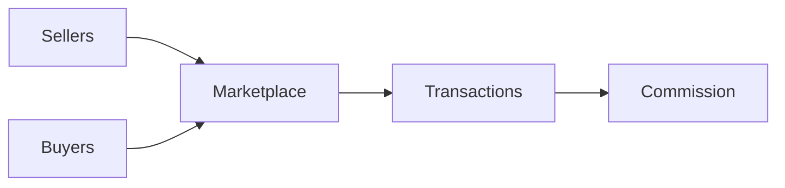

# Marketplace

Multi-vendor marketplace platform.

## System Context

## System Containers

## Overview

## Features

- Seller onboarding
- Product listings
- Buyer discovery
- Order management
- Commission tracking
- Ratings and reviews
- Dispute resolution
- Payment disbursement
