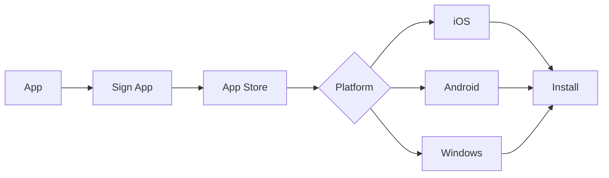

# App Distribution

Distribute apps to mobile devices and manage app delivery.

## Distribution Methods

- Internal app store
- Public app stores
- Direct distribution
- Enterprise distribution
- Beta distribution
- A/B distribution
- Staged rollout
- Targeted distribution

## App Store Features

- App catalog
- App search
- App filtering
- App reviews
- App ratings
- Installation tracking
- Update management
- Version control

## Installation

- Automatic installation
- Prompted installation
- Optional installation
- Required installation
- Scheduled installation
- Dependency management
- Prerequisite checking

## Updates

- Auto updates
- Staged rollout
- Rollback capability
- Update history
- Update status
- Update notifications
