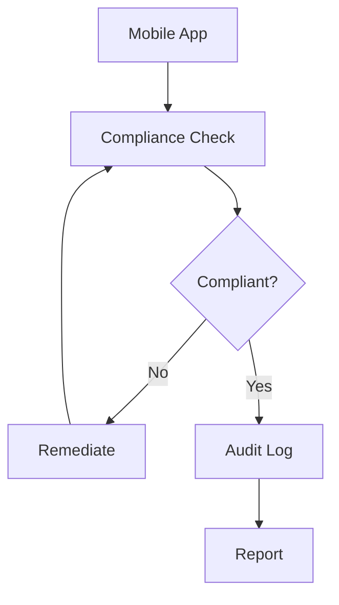

# Compliance & Audit

Ensure compliance and maintain audit trails for mobile apps.

## Compliance Features

- Policy enforcement
- Compliance monitoring
- Compliance reporting
- Compliance assessment
- Policy violation alerts
- Remediation tracking
- Audit logging
- Data retention

## Policies

- Device policies
- App policies
- Security policies
- Data policies
- Usage policies
- Compliance policies
- Custom policies

## Audit

- Activity logging
- User actions
- Admin actions
- System changes
- Policy changes
- Data access
- Data changes
- Compliance events

## Reporting

- Compliance report
- Audit report
- Policy violation report
- User activity report
- Security report
- Data access report
- Management report

## Standards

- GDPR compliance
- HIPAA compliance
- SOC 2 compliance
- ISO 27001 compliance
- Industry standards
