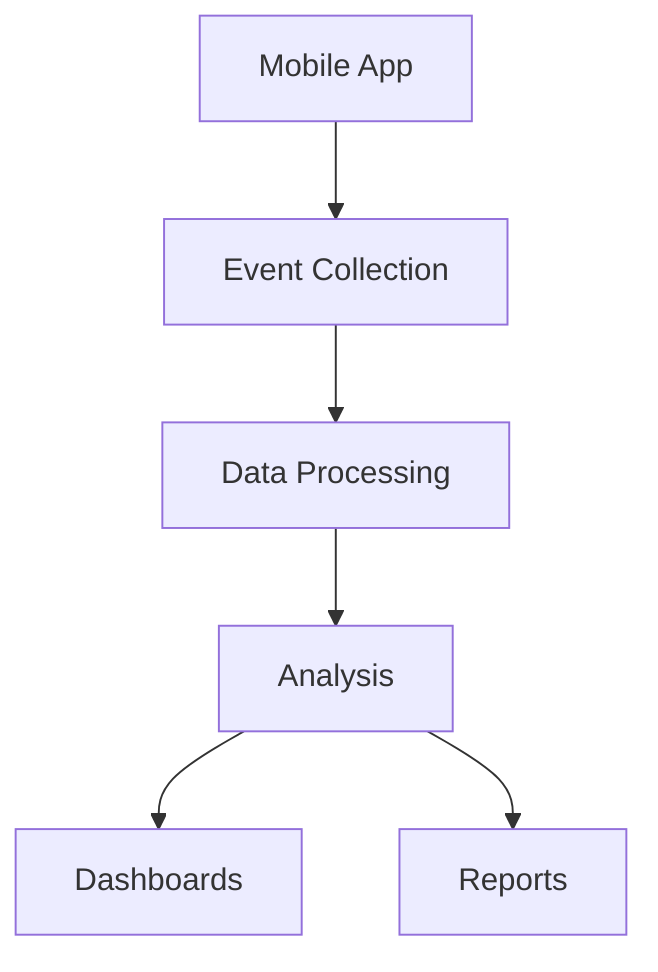

# Mobile Analytics

Analytics and performance monitoring for mobile apps.

## Analytics Features

- Screen view tracking
- Event tracking
- User tracking
- Session tracking
- Crash reporting
- Performance tracking
- Network monitoring
- Battery usage

## Key Metrics

- Daily active users
- Monthly active users
- User retention
- Session length
- Screen flow
- Crash rate
- App performance
- Error rate

## Tracking

- In-app events
- Screen transitions
- User properties
- Session properties
- Custom events
- Event parameters
- User cohorts
- Funnel analysis

## Performance

- App startup time
- Screen load time
- Network latency
- Battery consumption
- Memory usage
- CPU usage
- Crash reports
- ANR detection

## Reports

- Daily reports
- Cohort analysis
- Retention reports
- Performance reports
- Crash reports
- Custom reports
