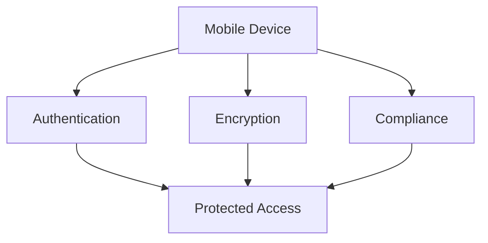

# Mobile Security

Comprehensive security for mobile devices and applications.

## Security Features

- Device encryption
- PIN/password policies
- Biometric authentication
- Remote wipe
- Data loss prevention
- Containerization
- VPN support
- Certificate management

## Mobile App Security

- App sandboxing
- App permissions
- Secure storage
- Data encryption
- API security
- SSL/TLS
- Certificate pinning
- Jailbreak detection

## Threat Protection

- Mobile threat defense
- Malware detection
- Phishing detection
- Exploit detection
- Anomaly detection
- Intrusion prevention
- DDoS protection

## Compliance

- Policy enforcement
- Compliance monitoring
- Audit logging
- Device compliance
- Data residency
- GDPR compliance
- HIPAA compliance
- Industry standards
