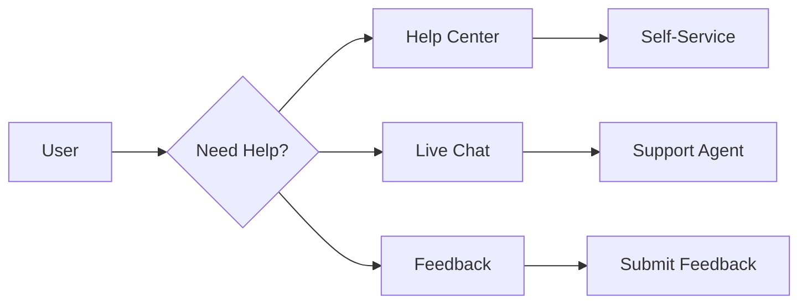

# Mobile Support & Help

In-app help system and mobile support.

## Help Features

- In-app help center
- Search functionality
- FAQ management
- Video tutorials
- Interactive guides
- Contextual help
- Breadcrumb navigation
- Search suggestions

## Support

- Live chat support
- Email support
- Phone support
- Ticket tracking
- Support history
- Knowledge base
- Help desk integration
- Escalation

## Feedback

- Feedback collection
- Feature requests
- Bug reports
- Rating prompts
- Survey management
- Sentiment analysis
- Response management

## Analytics

- Help usage
- Search queries
- FAQ performance
- Video views
- Tutorial completion
- Support metrics
- User satisfaction
