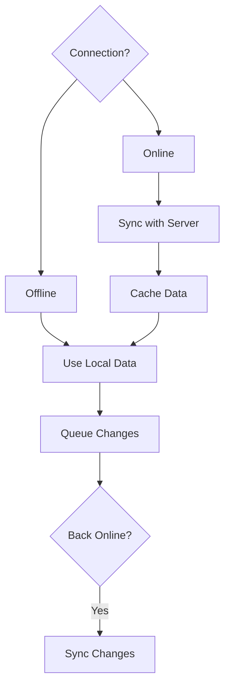

# Offline Functionality

Offline-first architecture for mobile apps.

## Offline Features

- Local data storage
- Data synchronization
- Offline detection
- Sync status
- Conflict resolution
- Data caching
- Compression
- Encryption

## Storage

- Local database
- File storage
- Cache storage
- Memory management
- Storage limits
- Data cleanup
- Storage optimization

## Synchronization

- Automatic sync
- Manual sync
- Background sync
- Smart sync
- Selective sync
- Incremental sync
- Conflict detection
- Conflict resolution

## Data Management

- Data queuing
- Change tracking
- Change history
- Rollback capability
- Compression
- Encryption
- Storage cleanup
- Archive management

## User Experience

- Offline indicator
- Sync status
- Loading state
- Error handling
- Data availability
- Functionality limitation
- Notification
