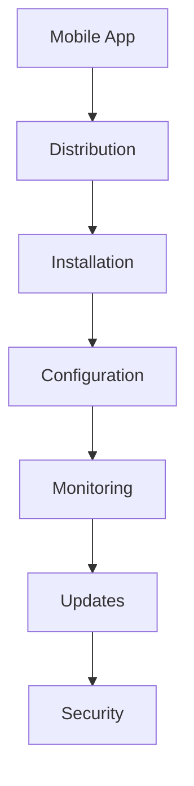

# Mobile App Management

Mobile application management and mobile device management.

## Core Features

- App distribution
- Device management
- App configuration
- Mobile analytics
- Mobile security
- App updates
- User management
- Compliance management

## App Management

- App packaging
- App signing
- App versioning
- App distribution
- App installation
- App updates
- App uninstallation
- App monitoring

## Integration Points

- **Security**: Mobile security
- **Analytics**: Mobile app metrics
- **Notifications**: Push notifications
- **User Management**: Device enrollment
