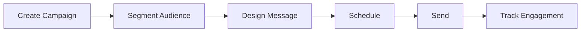

# Push Notifications

Manage mobile push notifications and campaigns.

## Push Features

- Rich notifications
- Scheduled delivery
- Audience segmentation
- Personalization
- A/B testing
- Deep linking
- Action buttons
- Media attachments

## Notification Types

- Transactional notifications
- Marketing notifications
- Alert notifications
- Reminder notifications
- News notifications
- Update notifications
- Custom notifications

## Segmentation

- User segments
- Device type segments
- Behavioral segments
- Geo-location segments
- Interest-based segments
- Custom segments

## Analytics

- Delivery rate
- Open rate
- Click rate
- Conversion rate
- Engagement metrics
- User segments
- A/B test results

## Optimization

- Optimal send time
- Frequency capping
- Personalization
- A/B testing
- Performance tracking
- User preferences
