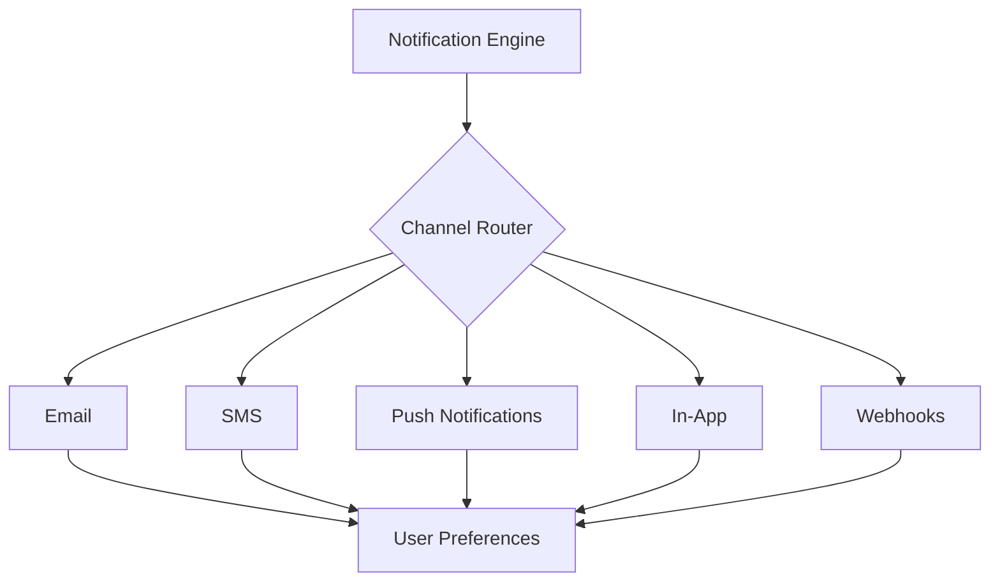

# Notifications

Send notifications across multiple channels to keep users informed.

## Notification Channels

- **Email**: HTML templates, scheduling
- **SMS**: Twilio integration, country codes
- **Push**: Web and mobile push notifications
- **In-App**: Toast, modal, banner notifications
- **Webhooks**: External system integration

## Features

- Template management
- Scheduling and delays
- User preference management
- Delivery tracking
- Bounce handling
- Unsubscribe management

## Integration Points

- **User Management**: Recipient information
- **Billing**: Payment notifications
- **Analytics**: Engagement tracking
- **Integrations**: External notification dispatch
