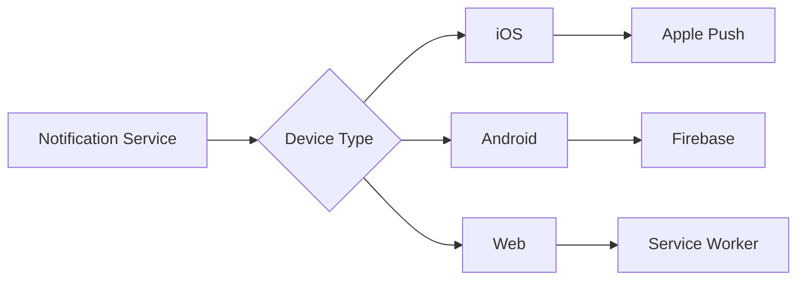

# Push Notifications

Send real-time notifications to web and mobile applications.

## Push Capabilities

- Web push notifications
- Mobile push (iOS, Android)
- Rich notifications with images
- Action buttons
- Deep linking
- Scheduled delivery

## Features

- Device token management
- Segmentation
- Personalization
- Click tracking
- Delivery confirmation
- Retry logic

## Best Practices

- Optimal send times
- Frequency capping
- User preference management
- Opt-in/opt-out handling
