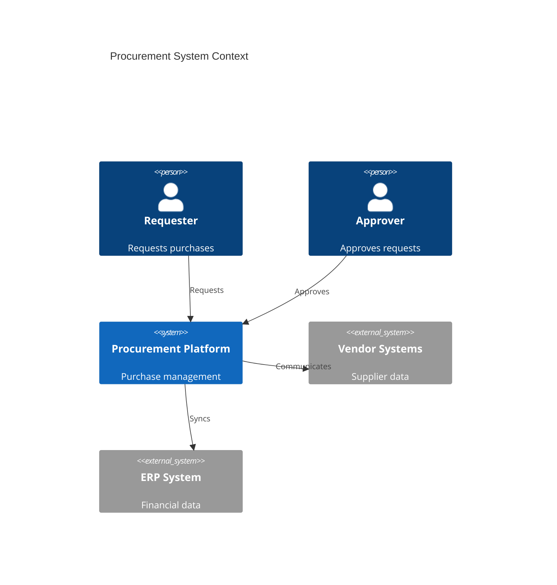
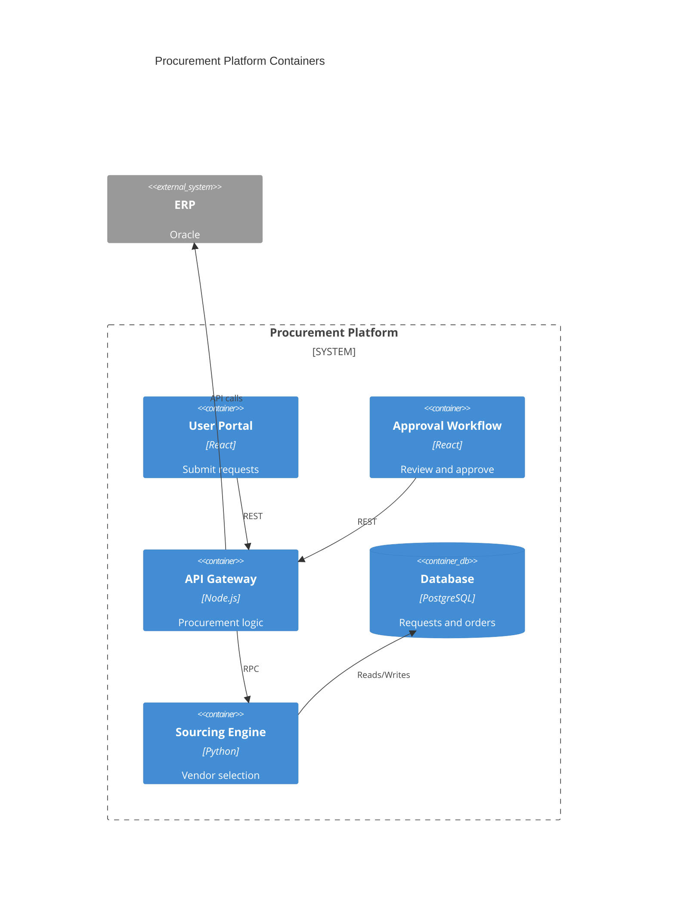
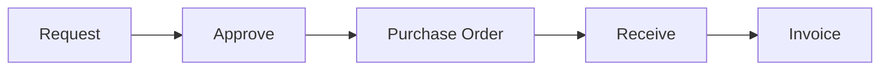

# Procurement

Procurement and purchasing management.

## System Context

## System Containers

## Overview

## Features

- Purchase requisitions
- Approval workflows
- Vendor selection
- RFQ management
- Purchase orders
- Receiving process
- Invoice matching
- Payment processing
