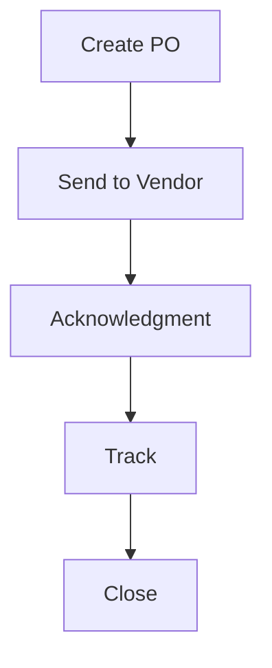

# Purchase Orders

Purchase order creation and management.

## Features

- PO templates
- Line item details
- Pricing terms
- Delivery schedules
- Tax calculation
- Vendor communication
- Amendment tracking
- PO history
