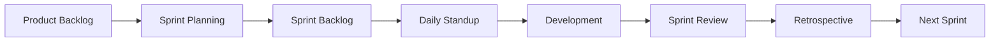

# Agile & Scrum

Agile and Scrum framework support for iterative development.

## Agile Features

- Product backlog
- Sprint planning
- Sprint backlog
- Story points
- Velocity tracking
- Burndown charts
- Impediment tracking
- Sprint retrospectives

## Scrum Artifacts

- Product backlog
- Sprint backlog
- Increment
- Definition of done
- Sprint goal
- User stories
- Acceptance criteria

## Ceremonies

- Sprint planning
- Daily standup
- Sprint review
- Retrospective
- Backlog refinement
- Backlog grooming

## Reporting

- Velocity reports
- Burndown charts
- Sprint reports
- Backlog reports
