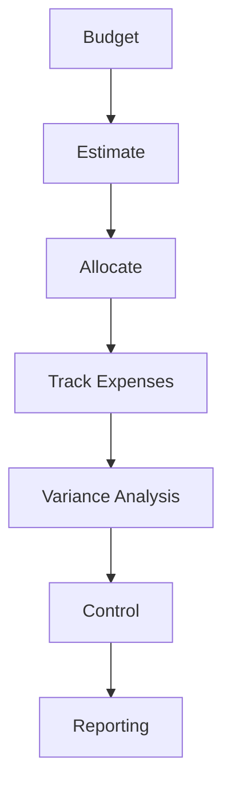

# Budget & Cost

Project budgeting and cost management.

## Budget Management

- Budget creation
- Cost estimation
- Budget allocation
- Cost tracking
- Expense management
- Invoice tracking
- Payment processing
- Budget variance

## Cost Tracking

- Labor costs
- Material costs
- Equipment costs
- Overhead costs
- Vendor costs
- Contract costs
- Contingency budget

## Analysis

- Budget vs actual
- Cost variance
- Schedule variance
- Earned value
- Forecast at completion
- Cost performance index
- Schedule performance index

## Reporting

- Budget reports
- Cost reports
- Expense reports
- Variance reports
- Financial reports
