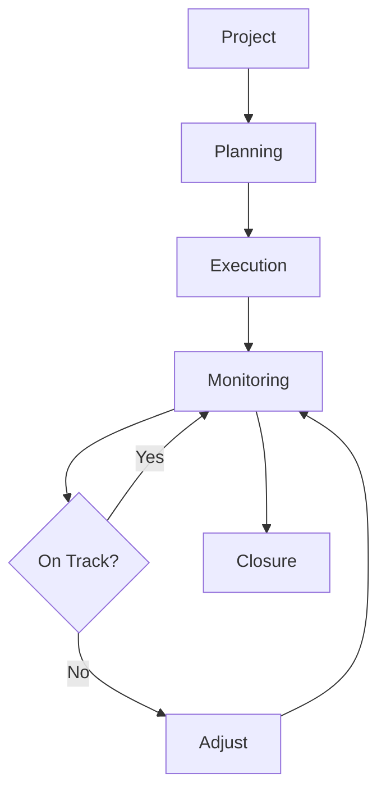

# Project Management

Comprehensive project management for planning, executing, and monitoring projects.

## Core Features

- Project creation
- Team assignment
- Budget management
- Resource allocation
- Timeline planning
- Risk management
- Status tracking
- Stakeholder management

## Project Types

- Agile projects
- Waterfall projects
- Hybrid projects
- Portfolio management
- Program management
- Portfolio planning

## Integration Points

- **Collaboration**: Team coordination
- **Analytics**: Project metrics
- **Notifications**: Project alerts
- **Reporting**: Project reports
