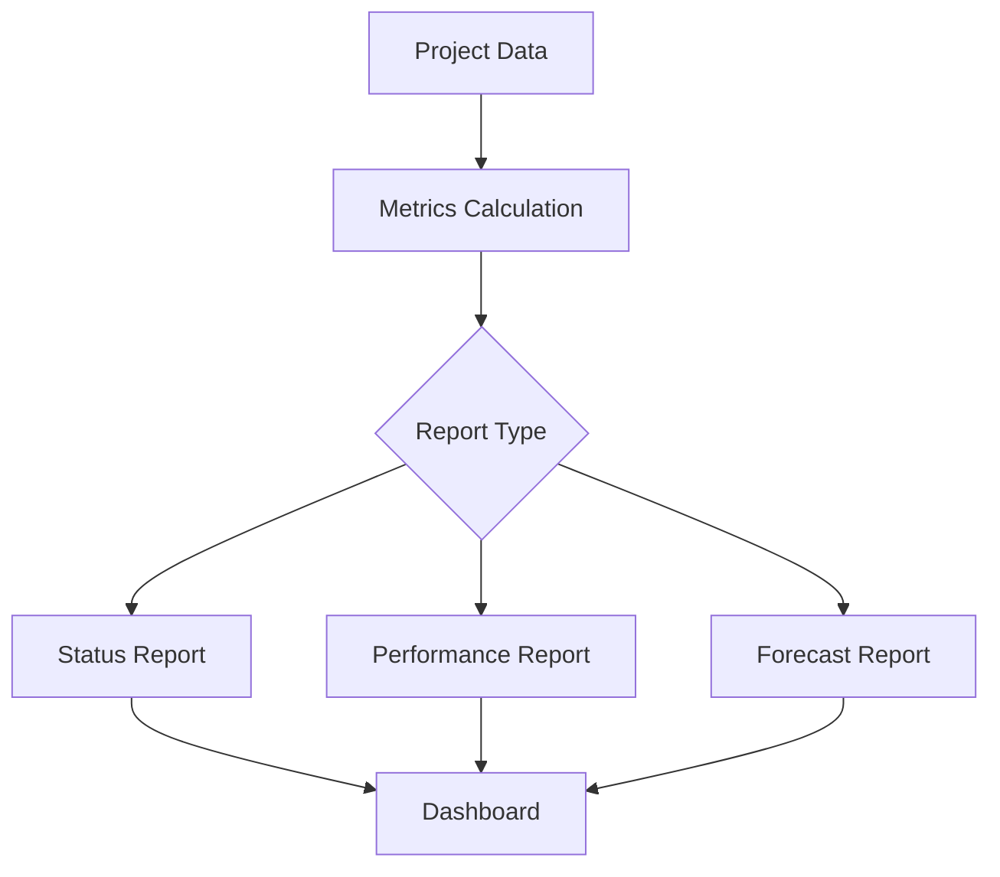

# Project Analytics

Analytics and reporting for project performance.

## Project Metrics

- Schedule performance
- Budget performance
- Resource utilization
- Quality metrics
- Risk metrics
- Stakeholder satisfaction
- Project health
- Velocity

## Reports

- Project status
- Progress reports
- Performance reports
- Budget reports
- Risk reports
- Quality reports
- Resource reports
- Lessons learned

## Dashboards

- Executive dashboard
- Project manager dashboard
- Team dashboard
- Portfolio dashboard
- Resource dashboard
- Budget dashboard
