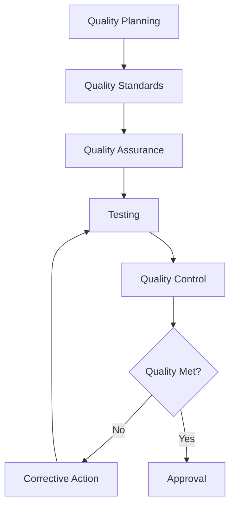

# Quality Management

Quality assurance and quality control for projects.

## Quality Features

- Quality standards
- Quality metrics
- Quality audits
- Testing plans
- Test cases
- Bug tracking
- Defect management
- Quality reports

## Testing

- Unit testing
- Integration testing
- System testing
- UAT
- Performance testing
- Security testing
- Regression testing

## Defect Management

- Bug reports
- Bug tracking
- Bug assignment
- Priority levels
- Severity levels
- Resolution
- Verification
- Closure

## Quality Reports

- Quality metrics
- Defect reports
- Testing reports
- Quality trends
