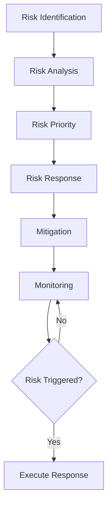

# Risk Management

Identify and manage project risks and issues.

## Risk Management

- Risk identification
- Risk register
- Risk scoring
- Probability assessment
- Impact assessment
- Risk mitigation
- Contingency plans
- Risk monitoring

## Risk Types

- Technical risks
- Resource risks
- Schedule risks
- Cost risks
- External risks
- Organizational risks
- Stakeholder risks

## Risk Response

- Mitigate
- Avoid
- Accept
- Escalate
- Contingency plans
- Fallback plans
- Risk owners
- Action tracking

## Reporting

- Risk register
- Risk status
- Risk metrics
- Risk trends
- Risk dashboard
