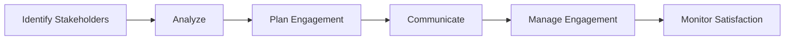

# Stakeholder Management

Manage stakeholder engagement and communication.

## Stakeholder Features

- Stakeholder register
- Stakeholder analysis
- Power/interest grid
- Engagement strategy
- Communication plan
- Feedback collection
- Issue resolution
- Escalation

## Stakeholder Types

- Executives
- Sponsors
- Customers
- Users
- Team members
- Vendors
- Regulators
- Community

## Engagement

- Engagement strategy
- Communication plan
- Status updates
- Meetings
- Reviews
- Feedback sessions
- Reports
- Celebration

## Analysis

- Stakeholder matrix
- Power/interest
- Engagement levels
- Satisfaction tracking
