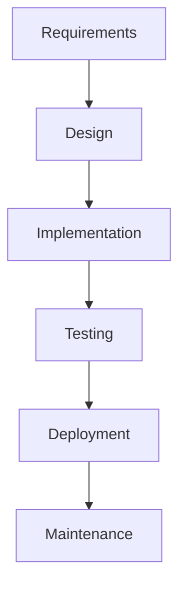

# Waterfall Planning

Traditional waterfall project planning and execution.

## Waterfall Features

- Phase-based planning
- Gantt charts
- Critical path analysis
- Milestone tracking
- Dependency management
- Gate reviews
- Stage gates
- Change management

## Project Planning

- Requirements phase
- Design phase
- Development phase
- Testing phase
- Deployment phase
- Maintenance phase
- Phase gates
- Documentation

## Tracking

- Task tracking
- Progress tracking
- Milestone tracking
- Critical path
- Schedule variance
- Cost variance
- Earned value

## Documentation

- Requirements document
- Design document
- Test plans
- Deployment plan
- User manual
