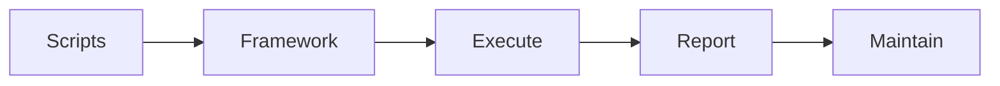

# Automation

Test automation framework.

## Features

- Automation framework
- Script creation
- Regression testing
- CI/CD integration
- Parallel execution
- Reporting dashboards
- Performance testing
- Load testing
