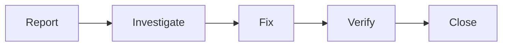

# Defect Management

Defect tracking and management.

## Features

- Defect reporting
- Severity classification
- Assignment tracking
- Resolution tracking
- Verification testing
- Root cause analysis
- Trend analysis
- Metrics reporting
