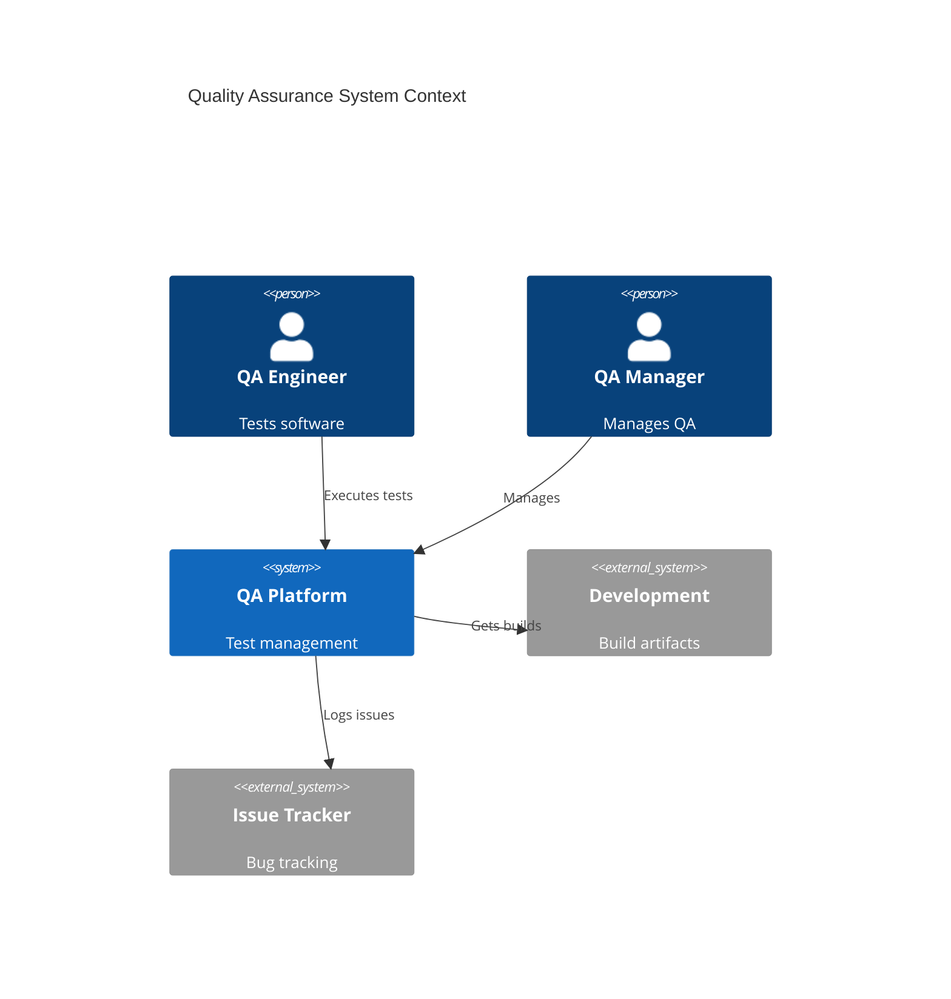
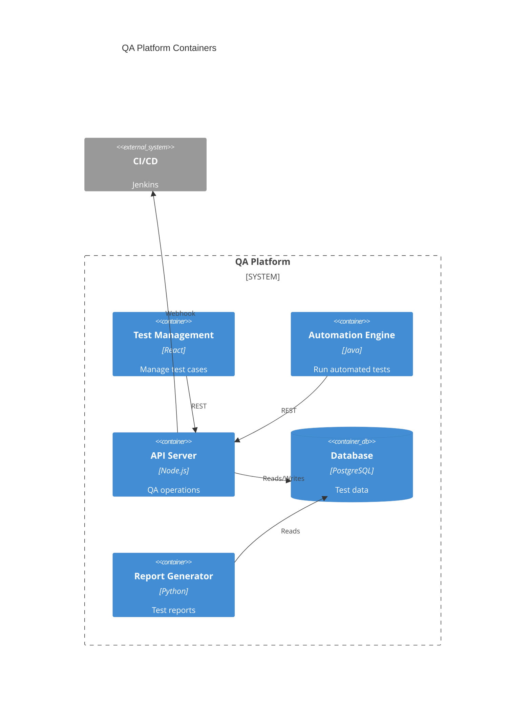
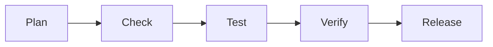

# Quality Assurance

Quality assurance and management.

## System Context

## System Containers

## Overview

## Features

- Test planning
- Test execution
- Defect tracking
- Quality metrics
- Issue management
- Release management
- Documentation
- Compliance testing
