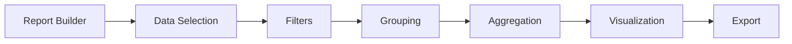

# Custom Reports

Create tailored reports with advanced filtering and customization.

## Builder Features

- Drag-and-drop interface
- Field selection
- Advanced filtering
- Calculated fields
- Grouping and sorting
- Custom aggregations
- Conditional formatting

## Report Elements

- Tables
- Charts
- Summaries
- Subtotals
- Page breaks
- Watermarks
- Branding

## Data Sources

- Database tables
- API data
- File uploads
- Real-time streams
- Historical data
- Computed metrics
