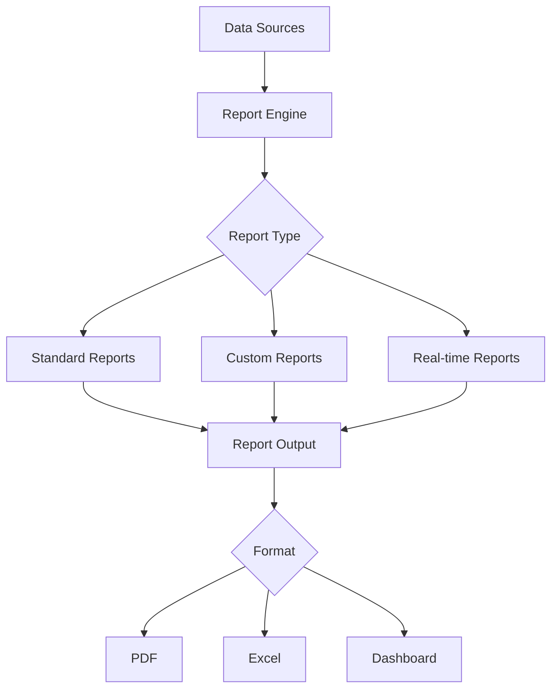

# Reporting

Comprehensive reporting system for business intelligence and insights.

## Report Types

- Executive summaries
- Sales reports
- Financial reports
- User analytics
- Performance metrics
- Compliance reports
- Custom reports

## Features

- Scheduled report delivery
- Email distribution
- Report templates
- Data filtering and drill-down
- Multi-format export
- Historical comparisons
- Trend analysis

## Distribution

- Email delivery
- Dashboard integration
- API access
- Webhook delivery
- File storage
- Notification alerts
- Scheduled generation

## Integration Points

- **Analytics**: Data source
- **Billing**: Financial data
- **Notifications**: Report delivery
- **Security**: Access control
