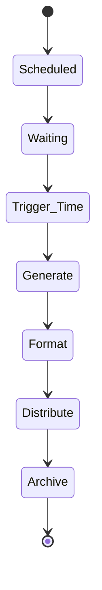

# Scheduled Reports

Automate report generation and distribution on a schedule.

## Scheduling Options

- Daily
- Weekly
- Monthly
- Quarterly
- Custom intervals
- Business days only
- Holiday awareness

## Distribution Methods

- Email recipients
- Dashboard publication
- File storage
- Webhook delivery
- Slack messages
- API endpoints
- FTP upload

## Report Features

- Pre-generated caching
- Incremental updates
- Compression
- Encryption
- Signature
- Delivery confirmation
- Retry logic

## Management

- View schedule
- Modify recipients
- Change frequency
- Pause/resume
- Manual run
- History tracking
